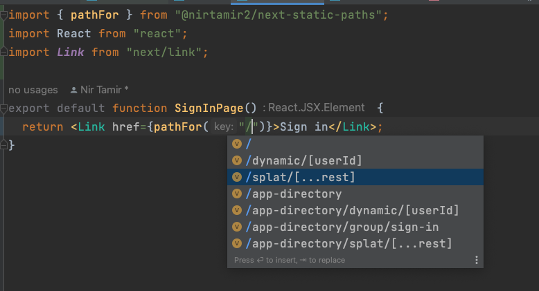

# `next-static-paths`

Statically prevent HTTP 404 Not Found in your Next.js applications using TypeScript and code generation.

## Features

💻 A command-line interface to generate static types and custom route helper functions

🔗 A `<TypedLink />` component which wraps Next.js `<Link />` and provides type-safe path matching

📝 A `urlFor` helper that enables path generation in a type-safe manner

## Usage

```sh-session
$ pnpm add next-static-paths
# or
$ yarn add next-static-paths
# or
$ npm install next-static-paths
```

Then, from within your Next.js application root, run the following command:

```sh-session
# For pnpm users
$ pnpx next-static-paths

# For yarn users
$ yarn next-static-paths

# For npm users
$ npx next-static-paths
```

## Usage screenshots

#### Path autocomplete



#### Dynamic path segment type checking


