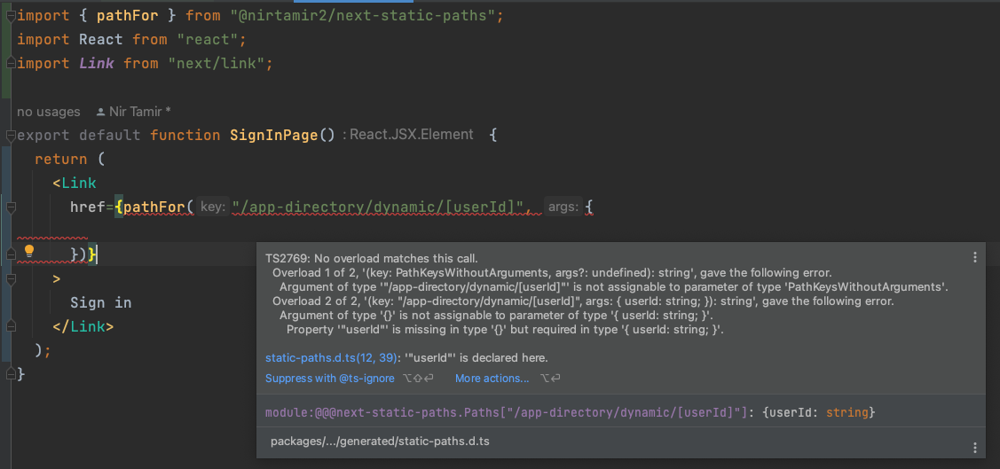

This is a fork of [next-static-paths](https://github.com/Schniz/next-static-paths)
that supports next.js 13 app router.

Although [Next.js 13.2](https://nextjs.org/blog/next-13-2#statically-typed-links) added experimental `typeRoutes` feature for statically typed links -
we cannot easily search them as plain text.
See https://github.com/vercel/next.js/discussions/50118

# `@nirtamir2/next-static-paths`

[](https://badge.fury.io/js/@nirtamir2%2Fnext-static-paths)

Statically prevent HTTP 404 Not Found in your Next.js applications using TypeScript and code generation.

## Features

💻 A command-line interface to generate static types and custom route helper functions

🔗 A `<TypedLink />` component which wraps Next.js `<Link />` and provides type-safe path matching

📝 A `pathFor` helper that enables path generation in a type-safe manner

## Usage

```sh-session
$ pnpm add @nirtamir2/next-static-paths
# or
$ yarn add @nirtamir2/next-static-paths
# or
$ npm install @nirtamir2/next-static-paths
```

Then, from within your Next.js application root, run the following command:

```sh-session
# For pnpm users
$ pnpx @nirtamir2/next-static-paths

# For yarn users
$ yarn @nirtamir2/next-static-paths

# For npm users
$ npx @nirtamir2/next-static-paths
```

## Usage screenshots

#### Path autocomplete


#### Dynamic path segment type checking


